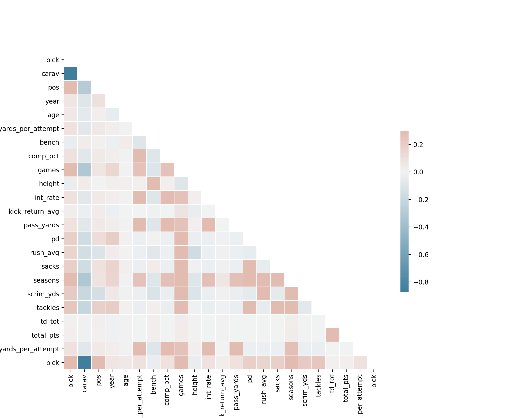
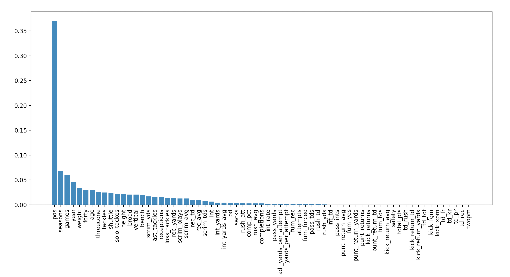

# Project Proposal
### Introduction
The National Football League is a very popular league in America, and the draft is the primary way in which teams get players straight out of college. Thus, we are very interested in predicting what teams should draft players at which position and when. 

### Problem Definition
We are looking to find the ideal draft position for a team to move up or down to in order to get a player at the optimal position at the best value. Given football data and possible params, pick number, team, player rankings, positions of the draft-eligible players: output a position at which the team has the best value

### Methods
First, for the clustering problem, we plan to come up with some consistent metrics across all players/positions. This will enable us to run a clustering algorithm. We feel that a Gaussian Mixture Model would be most appropriate, as positions are fluid and thus we would like soft assignment, but we don’t expect there to be constant density in the data so we think DBSCAN would not do too well. We also plan to try hierarchical clustering; from this clustering, we hope to gain some insight into how to reduce the problem by combining some positions. 

We plan to simplify the problem by assuming that a team has a rank of positions that it wants (ex. QB, defensive lineman, etc), they will pick the top ranked player available for their top position, and if no players ranked in the top 10 of players still available are still available for the team’s top position, they will move on to their 2nd to top position, etc. Though this is not always true, this simplifying assumption allows us to reduce this into a classification problem. Because we are going to put a significant amount of work into feature engineering during our data analysis phase, we expect that a simple predictive model such as SVM will be sufficient, but we plan to explore an SVM, linear regression, and a simple deep neural network.  

### Potential Results
From our clustering, we want to primarily derive analysis; namely, we want to get more insight into what positions are similar and what positions we can combine to reduce the problem. Additionally, we hope to derive some “weightings” to help us to come up with unified statistics across most or all positions. Since each position has different statistics that are tracked, coming up with a few unified statistics about all players will greatly help us during the predictive modeling phase. 

From our predictive model, we hope to have a model that will predict what position a team wants to take for any given pick. We can then use this to do a full draft simulation, however, this will be highly stochastic as even just a small number of wrong predictions compared to reality will cause our simulation draft to greatly diverge from reality. Thus, a more practical use/result would be to simply predict the next pick for a team while the draft is happening. 

### Discussion
There has been significant research on this topic, for various purposes from entertainment to betting to academia. Some publicly available datasets of note are [1] and [2]. Additionally, [3] uses simple linear regression with feature engineering to achieve results in predicting quarterback performance. Finally, [4] applies similar methods to tight ends. 

### Checkpoint
We expect the data collection/wrangling to be difficult, so we will set our checkpoint as having all of the data collected and cleaned, with some basic analysis work done so we have a grasp on what we are working with and can better gauge the methods we will need for the classification step.

# Checkpoint Results
## Data Wrangling
We got our data from two main sources, [api.collegefootballdata.com](api.collegefootballdata.com) and [https://github.com/leesharpe/nfldata/blob/master/data/draft_picks.csv](https://github.com/leesharpe/nfldata/blob/master/data/draft_picks.csv), the latter of which is just taken from the NFL's website.
We had to perform some processing to the data to get it into a workable format. The steps are as follows:
- Download the data from the API
- Reformat the data so that each row is one player during their senior year
- Join the player stats dataset with the draft pick dataset using a `JOIN` operation

Once we had this dataset, we could perform some analysis. We checked NaN percentages and quartiles:

```
Duplicate percentage: 0.0007580224037733174
Null/NaN percentages:
player                  0.000000
team                    0.000000
conference              0.000000
season                  0.000000
team_picked            90.011800
round                  90.011800
pick                   90.011800
side                   90.011800
category               90.011800
position               90.011800
rushing.YPC            96.698696
rushing.LONG           96.743650
puntReturns.YDS        99.157114
rushing.CAR            96.881322
rushing.YDS            96.951562
kicking.XPM            99.499888
passing.TD             99.103731
interceptions.AVG      96.886941
kicking.FGA            99.477411
rushing.TD             96.659362
receiving.YDS          94.501573
receiving.LONG         94.813441
receiving.REC          94.729153
puntReturns.NO         99.100922
passing.YDS            99.120589
receiving.TD           94.706676
punting.NO             99.449314
interceptions.INT      97.215666
receiving.YPR          94.852776
kicking.XPA            99.466172
puntReturns.TD         99.140256
passing.PCT            99.058777
passing.YPA            99.070016
punting.TB             99.452124
kicking.LONG           99.530793
punting.In_20          99.485840
kicking.PTS            99.415599
punting.YPP            99.404361
passing.ATT            99.078445
punting.LONG           99.381884
passing.INT            99.117779
passing.COMPLETIONS    99.179591
interceptions.TD       97.063947
puntReturns.AVG        99.137447
interceptions.YDS      97.083614
puntReturns.LONG       99.182401
kicking.PCT            99.449314
punting.YDS            99.412789
kicking.FGM            99.505507
kickReturns.LONG       98.898629
kickReturns.NO         98.873342
kickReturns.TD         98.994156
kickReturns.AVG        98.982918
kickReturns.YDS        98.943583
fumbles.REC            98.996966
fumbles.LOST           99.067206
defensive.QB_HUR       96.268824
defensive.TFL          96.516071
fumbles.FUM            98.952012
defensive.TD           96.566644
defensive.SOLO         96.636885
defensive.SACKS        96.496404
defensive.TOT          96.423354
defensive.PD           96.487975
dtype: float64

                           min          q1     median        q3               max  unique  
category                   NaN         NaN        NaN       NaN               NaN      11   
conference                 ACC         NaN        NaN       NaN  Western Athletic      14   
defensive.PD                 0     0.00000     0.0000     2.000                14      15   
defensive.QB_HUR             0     0.00000     0.0000     1.000                14      13   
defensive.SACKS              0     0.00000     0.0000     1.000              12.5      25   
defensive.SOLO               0     2.00000     7.0000    20.000                95      66   
defensive.TD                 0     0.00000     0.0000     0.000                 2       3   
defensive.TFL                0     0.00000     1.0000     3.000              21.5      36   
defensive.TOT                0     3.00000    14.0000    35.000               147     101   
fumbles.FUM                  0     0.00000     1.0000     1.000                 7       8   
fumbles.LOST                 0     0.00000     0.0000     1.000                 5       6   
fumbles.REC                  0     0.00000     1.0000     1.000                 4       5   
interceptions.AVG           -8     0.00000     9.5000    20.850               100     215   
interceptions.INT            1     1.00000     1.0000     2.000                 9       8   
interceptions.TD             0     0.00000     0.0000     0.000                 2       3   
interceptions.YDS           -6     0.00000    14.0000    37.750               230     131   
kickReturns.AVG             -3    10.35000    17.2500    22.175              72.7     140   
kickReturns.LONG           -13    11.00000    21.5000    33.000               100      83   
kickReturns.NO               1     1.00000     2.0000     8.000                75      35   
kickReturns.TD               0     0.00000     0.0000     0.000                 3       4   
kickReturns.YDS             -5    13.00000    39.5000   148.000              1309     185   
kicking.FGA                  0    10.00000    16.0000    19.000                30      31   
kicking.FGM                  0     6.75000    11.0000    16.000                27      27   
kicking.LONG                 0    39.50000    46.0000    50.000                57      30   
kicking.PCT                  0     0.56725     0.7245     0.821                 1      75   
kicking.PTS                  0    29.00000    65.5000    85.250               136      98   
kicking.XPA                  0    15.00000    30.0000    39.000                75      57   
kicking.XPM                  0    13.25000    32.0000    43.000                78      63   
passing.ATT                  1     1.00000    37.5000   255.500               656     167   
passing.COMPLETIONS          0     1.00000    16.0000   131.000               358     133   
passing.INT                  0     0.00000     1.0000     6.000                21      21   
passing.PCT                  0     0.47250     0.5850     0.667                 1     129   
passing.TD                   0     0.00000     1.0000     9.000                41      37   
passing.YDS                -49     5.00000    99.0000  1466.000              4768     206   
passing.YPA                 -1     4.65000     6.6000     8.000                84      97   
pick                         1    61.00000   120.0000   187.000               261     257   
player                                 NaN        NaN       NaN        Zyon McGee   33517   
position                   NaN         NaN        NaN       NaN               NaN      26   
puntReturns.AVG            -13     2.00000     5.6000    10.000                95     135   
puntReturns.LONG           -14     4.50000    16.0000    34.500                95      84   
puntReturns.NO               0     1.00000     3.0000    13.000                61      40   
puntReturns.TD               0     0.00000     0.0000     0.000                 3       4   
puntReturns.YDS            -14     5.75000    24.5000    92.250               330     140   
punting.In_20                0     0.00000     0.0000     0.000                26      19   
punting.LONG                 0    53.75000    59.0000    65.250                89      52   
punting.NO                   1    22.75000    46.0000    56.250                83      66   
punting.TB                   0     0.00000     0.0000     0.000                10       8   
punting.YDS                  0   474.00000  1812.0000  2416.000              3532     189   
punting.YPP                  0    37.77500    40.7500    43.200                58     118   
receiving.LONG              -6    15.00000    28.0000    44.000                98      99   
receiving.REC                1     3.00000    10.0000    24.000               120      89   
receiving.TD                 0     0.00000     1.0000     2.000                15      16   
receiving.YDS               -4    33.00000   112.0000   306.000              1680     631   
receiving.YPR              -11     8.00000    11.0000    14.000                78     239   
round                        1     2.00000     4.0000     6.000                 7       7   
rushing.CAR                  0     2.00000    11.0000    54.750               319     193   
rushing.LONG                 0     6.00000    17.0000    36.000                99      92   
rushing.TD                   0     0.00000     0.0000     2.000                29      26   
rushing.YDS               -306     4.00000    32.0000   196.000              2102     434   
rushing.YPC                -32     1.70000     4.0000     5.450                68     191   
season                    2004  2009.00000  2015.0000  2018.000              2019      16 
```
We noticed a few things immediately:
- There are many players who may play only a few minutes the whole year, or not at all, and they are clearly not draft contenders
- Players in different positions often have wildly different statistics to describe them, so many players had lots of `NaN` values

To address the first issue, since we didn't have a "minutes played" metric, we decided to drop all players who were lower than the 75th percentile in every statistic.
Since so many players had NaN in so many statistics, this was a good way of seeing if the player played their position at all.
We are still working on how to address the second issue, and we will touch on it in a bit. 

Thus, in the end, some statistics on our dataset:
- We have draft information on 3555 players
- We have draft information on 9.98% of the players in our dataset
- During the join, we retained draft information on 66.46% of players
- We have statistics on 35619 players from 2004-2019

## Unsupervised Learning
We then began our data exploration process. We started by running some basic statistics on our data, which only further exposed this problem of the different positions having different statistics covering them (note the `NaN` percentages and percentiles).
Next we actually applied the 75th percentile exclusion metric. 
After that, we looked at the distribution of positions among players. 

Clearly the positions are imbalanced, but not heavily, and furthermore, since we aren't predicting position, this is not of much worry to us. 
We went on to PCA. We applied PCA directly to all of the statistics, first standardizing the features and replacing NaN values with the mean, reducing the features to 2 dimensions to visualize.

We noted that PCA did fairly poor job explaining variance, likely due to the linear dependence presented by replacing NaN values with the mean. 
This is further supported by the fairly flat explained variance distribution.

We nonetheless continued down the PCA route, though it may be worth exploring Isomaps further in later work.
Next, we looked to tackling the different positions issues. The statistics were broke up into some categories, such as defensive, offensive, passing, punting, interceptions, etc. and thus we performed PCA on the features in each of these categories, dropping the NaNs this time.

These results look valid, although the explained variances aren't particularly high. 
We tried to use the results of these PCAs to reduce the number of features by replacing, for example, the 10 defensive features with just the PCA 1st and 2nd components when trained on the defensive features.
When we then re-ran PCA on this reduced feature space, the algorithm performed somewhat better.

We think that with more nuanced methods we can potentially use this unsupervised method to reduce our feature space and help with our player positions problem.

Next we ran clustering algorithms on our dataset, using the Davies-Bouldin score to evaluate the clusters. 
We also compared the clusters to a plot of player positions, since we felt like this is a fairly natural way to cluster the players.


We used both KMeans and DBSCAN for clustering and PCA and Isomap for the vizualization of the clustering (projecting into 2D space).
We used the elbow method to pick `eps` for the DBSCAN, settling on 3.75 based off this plot:

KMeans clearly performed better, likely because our dataset is in such a high dimension, with the `NaN` introducing non-constant densities in the space.

Finally, we some general analysis using Seaborn's `pairplot` function as well as a correlation heatmap, this time including `pick`, which is the pick number, our dependent variable.


And the Spearman correlation heatmap:

Both correlation heatmaps show that there are fairly few strong correlations with pick number, mostly just passing percent and some defensive metrics, but even those correlations are weak.
However, it is expected that often statistics in the same category are correlated (defensive with defensive, passing with passing, etc).
The pair plot provides fairly little information. It does highlight some of the mostly weak relationships within categories, and also highlights the lack of any real connection between any one statistic and pick.

# Modelling
For this checkpoint, we kept our modelling very limited, as we wanted to get a good understanding of the data.
Thus, we just tried a Random Forest and an SVR model, mostly keeping the default parameters. The performance is as follows with a 90-10 train test split:
```
Random forest mean absolute error (in sample):     61.74134612472032
Random forest mean absolute error (out of sample): 57.61811924877714

SVR mean absolute error (in sample):               63.634657390211416
SVR mean absolute error (out of sample):           57.393961166462105
```
Note that there are ~250 picks in each draft. 
The random forest clearly overfits more, even after some tuning to reduce this, and we are hoping that this will be improved when we figure out how to overcome the player position problem. We plan to focus primarily on modelling from here on out. 

Finally, we used the random forest to get an approximate idea of feature importances.

Although these importances should be taken with a grain of salt (since the model is not performing too well), it still demonstrates some important features, namely the pretty common all around defensive, offensive, and passing metrics.
However, season is still the most important feature. We think that team needs and the draft outlook (which is highly season-dependent) may present some issues for us in the future.

### References
[1] Banta, K. (2018, March 17). _NFL Combine 2000-2017_. Kaggle. https://www.kaggle.com/kbanta11/nfl-combine. 

[2] Wexler, R. (2017, October 25). _EDA for NFL Draft Outcomes Data_. Kaggle. https://www.kaggle.com/rwexler/eda-for-nfl-draft-outcomes-data. 

[3] Wolfson, J., Addona, V., Schmicker, R. (2011, July 19). _The Quarterback Prediction Problem: Forecasting the Performance of College Quarterbacks Selected in the NFL Draft._ De Gruyter. https://www.degruyter.com/view/journals/jqas/7/3/article-jqas.2011.7.3.1302.xml.xml. 

[4] Mulholland, J., & Jensen, S. (2014, December 01). _Predicting the draft and career success of tight ends in the National Football League._ Retrieved October 01, 2020, from https://www.degruyter.com/view/journals/jqas/10/4/article-p381.xml