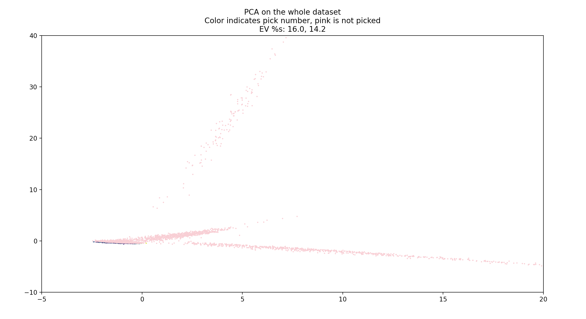
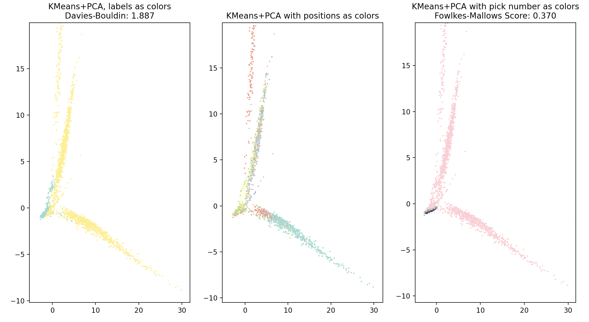
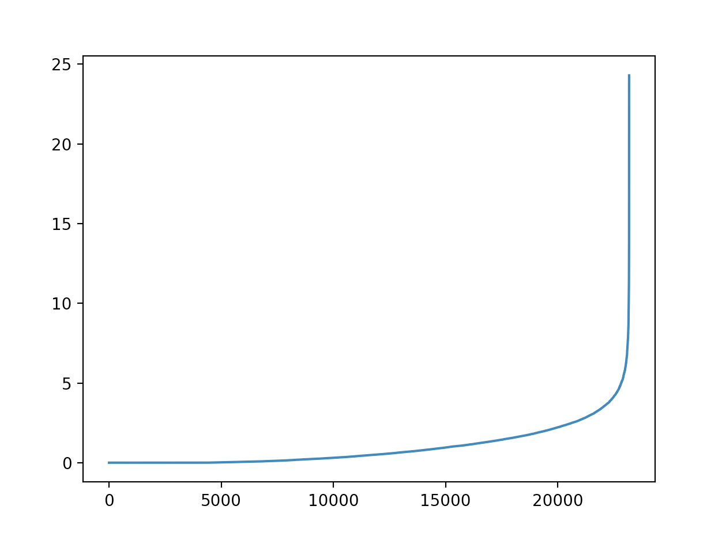

# Project Midterm Report
### Introduction
The National Football League is a very popular league in America, and the draft is the primary way in which teams get players straight out of college. Thus, we are very interested in predicting what teams should draft players at which position and when.

### Problem Definition
We are looking to predict, given a player's college career, what pick number and what pick round they will be in the NFL draft.

### Data Collection
We initially got our data from [api.collegefootballdata.com](api.collegefootballdata.com) and [https://github.com/leesharpe/nfldata/blob/master/data/draft_picks.csv](https://github.com/leesharpe/nfldata/blob/master/data/draft_picks.csv).

Once we had this dataset, we could perform some analysis. We checked NaN percentages and quartiles:

```
Duplicate percentage: 0.0007580224037733174
Null/NaN percentages:
player                  0.000000
team                    0.000000
conference              0.000000
season                  0.000000
team_picked            90.011800
round                  90.011800
pick                   90.011800
side                   90.011800
category               90.011800
position               90.011800
rushing.YPC            96.698696
rushing.LONG           96.743650
puntReturns.YDS        99.157114
rushing.CAR            96.881322
rushing.YDS            96.951562
kicking.XPM            99.499888
passing.TD             99.103731
interceptions.AVG      96.886941
kicking.FGA            99.477411
rushing.TD             96.659362
receiving.YDS          94.501573
receiving.LONG         94.813441
receiving.REC          94.729153
puntReturns.NO         99.100922
passing.YDS            99.120589
receiving.TD           94.706676
punting.NO             99.449314
interceptions.INT      97.215666
receiving.YPR          94.852776
kicking.XPA            99.466172
puntReturns.TD         99.140256
passing.PCT            99.058777
passing.YPA            99.070016
punting.TB             99.452124
kicking.LONG           99.530793
punting.In_20          99.485840
kicking.PTS            99.415599
punting.YPP            99.404361
passing.ATT            99.078445
punting.LONG           99.381884
passing.INT            99.117779
passing.COMPLETIONS    99.179591
interceptions.TD       97.063947
puntReturns.AVG        99.137447
interceptions.YDS      97.083614
puntReturns.LONG       99.182401
kicking.PCT            99.449314
punting.YDS            99.412789
kicking.FGM            99.505507
kickReturns.LONG       98.898629
kickReturns.NO         98.873342
kickReturns.TD         98.994156
kickReturns.AVG        98.982918
kickReturns.YDS        98.943583
fumbles.REC            98.996966
fumbles.LOST           99.067206
defensive.QB_HUR       96.268824
defensive.TFL          96.516071
fumbles.FUM            98.952012
defensive.TD           96.566644
defensive.SOLO         96.636885
defensive.SACKS        96.496404
defensive.TOT          96.423354
defensive.PD           96.487975
dtype: float64

                           min          q1     median        q3               max  unique  
category                   NaN         NaN        NaN       NaN               NaN      11   
conference                 ACC         NaN        NaN       NaN  Western Athletic      14   
defensive.PD                 0     0.00000     0.0000     2.000                14      15   
defensive.QB_HUR             0     0.00000     0.0000     1.000                14      13   
defensive.SACKS              0     0.00000     0.0000     1.000              12.5      25   
defensive.SOLO               0     2.00000     7.0000    20.000                95      66   
defensive.TD                 0     0.00000     0.0000     0.000                 2       3   
defensive.TFL                0     0.00000     1.0000     3.000              21.5      36   
defensive.TOT                0     3.00000    14.0000    35.000               147     101   
fumbles.FUM                  0     0.00000     1.0000     1.000                 7       8   
fumbles.LOST                 0     0.00000     0.0000     1.000                 5       6   
fumbles.REC                  0     0.00000     1.0000     1.000                 4       5   
interceptions.AVG           -8     0.00000     9.5000    20.850               100     215   
interceptions.INT            1     1.00000     1.0000     2.000                 9       8   
interceptions.TD             0     0.00000     0.0000     0.000                 2       3   
interceptions.YDS           -6     0.00000    14.0000    37.750               230     131   
kickReturns.AVG             -3    10.35000    17.2500    22.175              72.7     140   
kickReturns.LONG           -13    11.00000    21.5000    33.000               100      83   
kickReturns.NO               1     1.00000     2.0000     8.000                75      35   
kickReturns.TD               0     0.00000     0.0000     0.000                 3       4   
kickReturns.YDS             -5    13.00000    39.5000   148.000              1309     185   
kicking.FGA                  0    10.00000    16.0000    19.000                30      31   
kicking.FGM                  0     6.75000    11.0000    16.000                27      27   
kicking.LONG                 0    39.50000    46.0000    50.000                57      30   
kicking.PCT                  0     0.56725     0.7245     0.821                 1      75   
kicking.PTS                  0    29.00000    65.5000    85.250               136      98   
kicking.XPA                  0    15.00000    30.0000    39.000                75      57   
kicking.XPM                  0    13.25000    32.0000    43.000                78      63   
passing.ATT                  1     1.00000    37.5000   255.500               656     167   
passing.COMPLETIONS          0     1.00000    16.0000   131.000               358     133   
passing.INT                  0     0.00000     1.0000     6.000                21      21   
passing.PCT                  0     0.47250     0.5850     0.667                 1     129   
passing.TD                   0     0.00000     1.0000     9.000                41      37   
passing.YDS                -49     5.00000    99.0000  1466.000              4768     206   
passing.YPA                 -1     4.65000     6.6000     8.000                84      97   
pick                         1    61.00000   120.0000   187.000               261     257   
player                                 NaN        NaN       NaN        Zyon McGee   33517   
position                   NaN         NaN        NaN       NaN               NaN      26   
puntReturns.AVG            -13     2.00000     5.6000    10.000                95     135   
puntReturns.LONG           -14     4.50000    16.0000    34.500                95      84   
puntReturns.NO               0     1.00000     3.0000    13.000                61      40   
puntReturns.TD               0     0.00000     0.0000     0.000                 3       4   
puntReturns.YDS            -14     5.75000    24.5000    92.250               330     140   
punting.In_20                0     0.00000     0.0000     0.000                26      19   
punting.LONG                 0    53.75000    59.0000    65.250                89      52   
punting.NO                   1    22.75000    46.0000    56.250                83      66   
punting.TB                   0     0.00000     0.0000     0.000                10       8   
punting.YDS                  0   474.00000  1812.0000  2416.000              3532     189   
punting.YPP                  0    37.77500    40.7500    43.200                58     118   
receiving.LONG              -6    15.00000    28.0000    44.000                98      99   
receiving.REC                1     3.00000    10.0000    24.000               120      89   
receiving.TD                 0     0.00000     1.0000     2.000                15      16   
receiving.YDS               -4    33.00000   112.0000   306.000              1680     631   
receiving.YPR              -11     8.00000    11.0000    14.000                78     239   
round                        1     2.00000     4.0000     6.000                 7       7   
rushing.CAR                  0     2.00000    11.0000    54.750               319     193   
rushing.LONG                 0     6.00000    17.0000    36.000                99      92   
rushing.TD                   0     0.00000     0.0000     2.000                29      26   
rushing.YDS               -306     4.00000    32.0000   196.000              2102     434   
rushing.YPC                -32     1.70000     4.0000     5.450                68     191   
season                    2004  2009.00000  2015.0000  2018.000              2019      16
```
We noticed a few things immediately:
- There are many players who may play only a few minutes the whole year, or not at all, and they are clearly not draft contenders
- Players in different positions often have wildly different statistics to describe them, so many players had lots of `NaN` values

To address the issues of many `NaN` values and having different statistics for different positions, we decided to change our data source to [http://pro-football-reference.com/](http://pro-football-reference.com/), which includes much more information on players. Namely, this source provides draft information, Combine data, and college football data, and the set of statistics it offers is much more general, though most of the data overlaps with the previously mentioned sources. The process for both data collections was as follows:
- Download the data from the API (2000-2019 data)
- Compute average statistics across the player's whole college career

Once we downloaded the dataset, we collected the following statistics:
- We have 67 features as well as the pick information
- We have data on 10543 players in total
- Out of the 10543 players, 5902 weren't drafted at all and 4641 were drafted
- We had Combine data on 9277 players
- We had some college data on 7486 players

This dataset also included quite a few `NaN` values due to both the Combine and college data. As suggested by [1], we used Multiple Imputation by Chained Equations to "impute" or fill in `NaN` values with plausible other values. This method is largely regression-based. The exact algorithm is described in [2], but the general steps they describe are:

> Step 1: A simple imputation, such as imputing the mean, is performed for every missing value in the dataset. These mean imputations can be thought of as “place holders.”

> Step 2: The “place holder” mean imputations for one variable (“var”) are set back to missing.

> Step 3: The observed values from the variable “var” in Step 2 are regressed on the other variables in the imputation model, which may or may not consist of all of the variables in the dataset. In other words, “var” is the dependent variable in a regression model and all the other variables are independent variables in the regression model. These regression models operate under the same assumptions that one would make when performing linear, logistic, or Poison regression models outside of the context of imputing missing data.

> Step 4: The missing values for “var” are then replaced with predictions (imputations) from the regression model. When “var” is subsequently used as an independent variable in the regression models for other variables, both the observed and these imputed values will be used.

> Step 5: Steps 2–4 are then repeated for each variable that has missing data. The cycling through each of the variables constitutes one iteration or “cycle.” At the end of one cycle all of the missing values have been replaced with predictions from regressions that reflect the relationships observed in the data.

> Step 6: Steps 2–4 are repeated for a number of cycles, with the imputations being updated at each cycle.

After performing the imputing, we again analyzed percentiles on the data (now with almost no null values):
```
min       q1   median       q3           max  unique
adj_yards_per_attempt              -4.8     0.00     0.00     0.00          51.9     104
age                                  20    22.00    23.00    23.00            29      10
ast_tackles                           0     0.00     0.00     0.00           507     165
attempts                              0     0.00     0.00     0.00          3019     128
bench                                 2    15.00    19.00    24.00            49      45
broad                                74   109.00   115.00   120.00           147      63
carav                                -4     0.00     0.00     5.00           176     119
college                             NaN      NaN      NaN      NaN           NaN     394
comp_pct                              0     0.00     0.00     0.00           427     124
completions                           0     0.00     0.00     0.00          1934     126
forty                              4.22     4.55     4.70     4.97          6.05     159
fum_forced                            0     0.00     0.00     0.00            18      13
fum_rec                               0     0.00     0.00     0.00            33      11
fum_tds                               0     0.00     0.00     0.00             3       4
fum_yds                              -1     0.00     0.00     0.00           108      49
games                                 0     0.00     0.00     0.00            57      55
height                               65    72.00    74.00    76.00            82      18
int                                   0     0.00     0.00     0.00            16      17
int_rate                              0     0.00     0.00     0.00           902     130
int_td                                0     0.00     0.00     0.00             4       5
int_yards                           -25     0.00     0.00     0.00           381     181
int_yards_avg                     -28.2     0.00     0.00     0.00           158     263
kick_fgm                              0     0.00     0.00     0.00             0       1
kick_return_avg                       0     0.00     0.00     0.00          95.4      11
kick_return_td                        0     0.00     0.00     0.00             1       2
kick_return_yards                     0     0.00     0.00     0.00          2718      11
kick_returns                          0     0.00     0.00     0.00           112       9
kick_xpm                              0     0.00     0.00     0.00             0       1
loss_tackles                          0     0.00     0.00     0.00         123.5     101
n_college_picks                       1    55.00   106.00   166.00           248     100
pass_ints                             0     0.00     0.00     0.00            80      51
pass_tds                              0     0.00     0.00     0.00           172      80
pass_yards                            0     0.00     0.00     0.00         22940     132
pd                                    0     0.00     0.00     0.00            60      38
pick                                  1   141.00   257.00   257.00           262     262
player                 A'Shawn Robinson      NaN      NaN      NaN  Zuriel Smith    7197
pos                                   C      NaN      NaN      NaN            WR      25
punt_return_avg                      -2     0.00     0.00     0.00          50.3      25
punt_return_td                        0     0.00     0.00     0.00             4       5
punt_return_yards                    -2     0.00     0.00     0.00          1371      25
punt_returns                          0     0.00     0.00     0.00           117      18
rec_avg                              -6     0.00     0.00     0.00         114.6     415
rec_td                                0     0.00     0.00     0.00           105      60
rec_yards                            -6     0.00     0.00     0.00         13313     615
receptions                            0     0.00     0.00     0.00          2733     385
rush_att                              0     0.00     0.00     0.00           339     113
rush_avg                            -17     0.00     0.00     0.00          97.5     295
rush_td                               0     0.00     0.00     0.00            26      14
rush_yds                            -17     0.00     0.00     0.00          3368     313
sacks                                 0     0.00     0.00     0.00            63      58
safety                                0     0.00     0.00     0.00             1       2
scrim_avg                            -6     0.00     0.00     0.00         112.8     418
scrim_plays                           0     0.00     0.00     0.00          2900     391
scrim_tds                             0     0.00     0.00     0.00           114      61
scrim_yds                            -6     0.00     0.00     0.00         14624     626
seasons                               0     0.00     0.00     0.00             7       8
short_college                   Alabama      NaN      NaN      NaN     Wisconsin      75
shuttle                            3.73     4.19     4.33     4.53          5.56     153
solo_tackes                           0     0.00     0.00     0.00           439     192
tackles                               0     0.00     0.00     0.00           946     270
td_fr                                 0     0.00     0.00     0.00             1       2
td_kr                                 0     0.00     0.00     0.00             0       1
td_pr                                 0     0.00     0.00     0.00             0       1
td_rec                                0     0.00     0.00     0.00             0       1
td_rush                               0     0.00     0.00     0.00             1       2
td_tot                                0     0.00     0.00     0.00             2       3
team                                NaN      NaN      NaN      NaN           NaN      34
threecone                          6.28     6.97     7.18     7.50          9.12     226
total_pts                             0     0.00     0.00     0.00            12       4
twopm                                 0     0.00     0.00     0.00             0       1
vertical                           17.5    30.00    33.00    35.50            46      56
weight                              149   206.00   233.00   275.00           375     206
yards_per_attempt                     0     0.00     0.00     0.00          50.5      93
year                               2000  2005.00  2010.00  2014.00          2019      20
```

We should note that imputing features often is a source of bias, since often the imputer is trained on the whole dataset and thus gets information which a real model would not normally get (it gets to see part of the test set). For analysis, we trained the imputer on the whole dataset, but for modeling we trained the imputer only on the traing set.

### Methods
We have saved all our results and analysis for the Results section and thus we will only go over our methods here.

We then began our data exploration process. We plotted the distribution of player positions.

We then ran PCA both on all players and only players who were drafted, reducing the features to 2 dimensions to visualize. We also plotting the feature importances generated by PCA.

We then ran clustering algorithms on our dataset. We originally tried to use GMM and hierarchical clustering, but we found that the former performed very poorly, likely due to the imputing, and the later took an unreasonable amount of time to run on our large dataset, even with aggressive stopping conditions.

We then tried KMeans and and DBSCAN and we used both PCA and Isomap to reduce the dimensionality for visualization. We also compared the clusters to a plot of player positions, since we felt like this is a fairly natural way to cluster the players.

We used the elbow method to pick `eps` for the DBSCAN, settling on 3.75.

Next we some general analysis using Seaborn's `pairplot` function as well as a correlation heatmap, this time including `pick`, which is the pick number, our dependent variable.

After performing our initial analysis, we got to modeling We will focus on our regression modeling (predicting which pick number a player will be), as this was the bulk of what we did, but we will briefly touch on how this same dataset can be re-tooled to answer related questions.

For the regression, we used mean absolute error (MAE) as our primary metric to evaluate our model. Root mean squared error is often used for regression due to its nice differentiable properties used for gradient descent algorithms, but MAE is a much more intuitive metric. For example, a MAE of 40 means that the model, on average, is off by 40 picks. We also considered R squared (R2), which is the proportion of variance the model explains and is a more information-based way of looking at regression performance.

We started with the simplest model, linear regression. We used `sklearn.linear_model.LinearRegression`. This provided solid results out of the gate, but we wanted to move on to a more complex model.

We then moved on to the Support Vector Regressor model, `sklearn.svm.SVR`. This model applies many of the same ideas as the Support Vector Classifier that we learned about in class, still relying on a margin, the kernel trick, and soft penalties. However, since this model performs regression and not classification there are a few notable differences. Namely, the concept of a hard margin is replaced with an epsilon "tube" in which no loss penalty is applied. Also, the soft-margin zeta parameter, distance to the margin (or tube in this case) is as the regression output.

We had to tune the SVR model using cross validation. We adjusted the `epsilon` as well as the regularization parameter, `C` to achieve results with no overfitting.

After tuning the SVR we got better results than the linear regression, but only marginally, so we then briefly tried a neural network-based approach.

We then tried a neural network approach. We used `sklearn.neural_network.MLPRegressor` with hidden layer sizes of 64, 48, and 32. Due to our dataset living in a sort of "grey zone" of many high variance and poorly correlated features with relatively few training samples, we were left chasing our tails between overfitting and underfitting for a long time. This is because many of the common diagnostic techniques (adjusting regularization, removing features, adjusting model size, running for more iterations, adding more training data) were either ineffective or impossible. We finally settled on model hyperparameters that provided a significant improvement in performance by increasing regularization (`alpha`) but reducing the number of parameters/hidden layers. Also notably we used the ReLu activation function to help with the dying gradient problem during training.

We tried one final approach, namely a tree-based approach. We started with a random forest, `sklearn.ensemble.RandomForestClassifier`. We quickly tuned it to perform about the same as the neural network model. We then however discovered the eXtreme Gradient Boosting model, or XGBoost, implemented by the `xgboost` package. XGBoost does "gradient boosting," which can be thought of as a form of gradient descent. However, the key change provided by XGBoost is that we can form our next tree by considering what the previous tree's weaknesses were using a loss function, in a process called boosting. By combining boosting and bagging (which is simply the idea of training many weak models and ensembling them together), we can get a very powerful, resilient, and versatile model which has proved very effective in many tasks, as proved by its now relatively widespread use. [3] is the seminal paper on XGBoost and expands on the exact methods as well as why the model is so effective. This model performed quite well, but due to the increased complexity of the model, it was quickly overfitting. We tried multiple strategies to reduce overfitting, namely:
- Controlling model complexity by reducing `max_depth`, `min_child_weight`, and increasing `gamma`
- Adding randomness to the trees by reducing the `subsample` and `colsample_bytree`

Even after this tuning, the model was still overfitting a bit since the in-sample MAE was lower than the out-of-sample MAE.

We already tried using other features, and thus to attempt to combat overfitting we tried to reduce the number of features we were using. To do this, we trained a Random Forest model and sorted the feature importances generated by this model. We took all features that had >1% importance and tried re-training our model. This resulted in a reduction from 66 to 21 features. However, this barely improved the overfitting.

For our final modeling, we looked to tackle a problem related to our original regression problem. Namely, we looked to see if we could predict Career Approximate Value, which is a metric from [https://www.pro-football-reference.com/about/glossary.htm](https://www.pro-football-reference.com/about/glossary.htm). The Career Approximate Value is computed by summing 100% of the player's best-season AV, 95% of his second-best-season AV, 90% of his third best, and so on. The idea is that the Career AV rating should weight peak seasons slightly more than "compiler"-type seasons. It is a metric they developed to try to compare players across teams and eras.

# TODO:
# - wrap up xgboost methods (mention the overfitting and stuff)  √
# - talk about feature reduction and how it didnt do much        √
# - then the classification and carav models
# - then results/analysis (collect all the figures and numbers)
# - talk about the pick # vs MAE/merr plots (generate for more methods) and how they are opposite of professionals
# - then discussion - make sure to include a demo on 2018 data, like comparing what it got right and wrong, also compare to professionals https://www.fantasypros.com/nfl/accuracy/mock-drafts.php
# - compare the distribution of positions during first round, our model vs real data
# - then conclusion
# - add in some images everywhere
# - then video

# REMEMBER TO INCLUDE ANALYSIS FOR EVERYTHING

### Results

Talk about DummyRegressor

[comment]: # (Old stuff)

### Results
#### Position Distribution

Clearly the positions are imbalanced, but not too heavily, and furthermore, since we aren't predicting position, this is not of much worry to us.
#### PCA

We noted that PCA did fairly poor job explaining variance, likely due to the linear dependence presented by replacing NaN values with the mean.
This is further supported by the fairly flat explained variance distribution.

We then went on to the per-category PCAs:

These results look valid, although the explained variances aren't particularly high.

And then re-applying these PCA features to the whole dataset:

We think that with more nuanced methods we can potentially use this unsupervised method to reduce our feature space and help with our player positions problem.
#### Clustering



And the elbow method plot:

KMeans clearly performed better, likely because our dataset is in such a high dimension, with the `NaN` introducing non-constant densities in the space.

#### General Analysis


And the Spearman correlation heatmap:

Both correlation heatmaps show that there are fairly few strong correlations with pick number, mostly just passing percent and some defensive metrics, but even those correlations are weak.
However, it is expected that often statistics in the same category are correlated (defensive with defensive, passing with passing, etc).
The pair plot provides fairly little information. It does highlight some of the mostly weak relationships within categories, and also highlights the lack of any real connection between any one statistic and pick.

#### Random Forest and SVR
The performance of the random forest and the SVR is as follows with a 90-10 train test split:
```
Random forest mean absolute error (in sample):     61.74134612472032
Random forest mean absolute error (out of sample): 57.61811924877714

SVR mean absolute error (in sample):               63.634657390211416
SVR mean absolute error (out of sample):           57.393961166462105
```
Note that there are ~250 picks in each draft, and picks are approximately uniformly distributed from 1 to 250.
The random forest clearly overfits more, even after some tuning to reduce this, and we are hoping that this will be improved when we figure out how to overcome the player position problem. We plan to focus primarily on modelling from here on out.

#### Feature Importances

Although these importances should be taken with a grain of salt (since the model is not performing too well), it still demonstrates some important features, namely the pretty common all around defensive, offensive, and passing metrics.
However, season is still the most important feature. We think that team needs and the draft outlook (which is highly season-dependent) may present some issues for us in the future.

### Discussion
# TODO improve this discussion, see original project proposal
We believe that the largest challenge that we have yet to solve is that different positions have different statistics corresponding to them, and so many players have the majority of statistics set to `NaN`.
However, we have made significant headway towards solving this problem, namely using PCA to combine some features in a clever way.

Furthermore, the actual modelling step may be a bit tricky as well, because, as the literature suggests, there just generally isn't a very strong link between college performance and draft picking, both because a good player in college may not be good in the NFL, and because the draft often has to deal with what the teams want, not just how good the players are.
We think that with some more advanced models, while also taking steps to prevent overfitting, we can hopefully come up with a model that performs decently well despite this. However, we do have ideas on how to incorporate team needs into our model if it is needed, mostly by relying on trading metrics for existing players.

Finally, we think that some more manual feature engineering could be performed, though we would rather take the approach of coming up with a clever solution that will handle the features of all positions rather than manually engineer features for each of the 12+ positions.

### Conclusion
# TODO

# Original Proposal
We kept the original proposal just for reference.
### Methods
First, for the clustering problem, we plan to come up with some consistent metrics across all players/positions. This will enable us to run a clustering algorithm. We feel that a Gaussian Mixture Model would be most appropriate, as positions are fluid and thus we would like soft assignment, but we don’t expect there to be constant density in the data so we think DBSCAN would not do too well. We also plan to try hierarchical clustering; from this clustering, we hope to gain some insight into how to reduce the problem by combining some positions.

We plan to simplify the problem by assuming that a team has a rank of positions that it wants (ex. QB, defensive lineman, etc), they will pick the top ranked player available for their top position, and if no players ranked in the top 10 of players still available are still available for the team’s top position, they will move on to their 2nd to top position, etc. Though this is not always true, this simplifying assumption allows us to reduce this into a classification problem. Because we are going to put a significant amount of work into feature engineering during our data analysis phase, we expect that a simple predictive model such as SVM will be sufficient, but we plan to explore an SVM, linear regression, and a simple deep neural network.  

### Potential Results
From our clustering, we want to primarily derive analysis; namely, we want to get more insight into what positions are similar and what positions we can combine to reduce the problem. Additionally, we hope to derive some “weightings” to help us to come up with unified statistics across most or all positions. Since each position has different statistics that are tracked, coming up with a few unified statistics about all players will greatly help us during the predictive modeling phase.

From our predictive model, we hope to have a model that will predict what position a team wants to take for any given pick. We can then use this to do a full draft simulation, however, this will be highly stochastic as even just a small number of wrong predictions compared to reality will cause our simulation draft to greatly diverge from reality. Thus, a more practical use/result would be to simply predict the next pick for a team while the draft is happening.

### Discussion
There has been significant research on this topic, for various purposes from entertainment to betting to academia. Some publicly available datasets of note are [4] and [5]. Additionally, [6] uses simple linear regression with feature engineering to achieve results in predicting quarterback performance. Finally, [7] applies similar methods to tight ends.

### Checkpoint
We expect the data collection/wrangling to be difficult, so we will set our checkpoint as having all of the data collected and cleaned, with some basic analysis work done so we have a grasp on what we are working with and can better gauge the methods we will need for the classification step.

### References
[1] Taylor, S. (2017). _Learning the NFL Draft_. https://seanjtaylor.github.io/learning-the-draft/.

[2] Azur, M. J., Stuart, E. A., Frangakis, C., & Leaf, P. J. (2011). Multiple imputation by chained equations: what is it and how does it work?. International journal of methods in psychiatric research, 20(1), 40–49. https://doi.org/10.1002/mpr.329.

[3] Chen, Tianqi & Guestrin, Carlos. (2016). XGBoost: A Scalable Tree Boosting System. 785-794. 10.1145/2939672.2939785. https://arxiv.org/abs/1603.02754.

[4] Banta, K. (2018, March 17). _NFL Combine 2000-2017_. Kaggle. https://www.kaggle.com/kbanta11/nfl-combine.

[5] Wexler, R. (2017, October 25). _EDA for NFL Draft Outcomes Data_. Kaggle. https://www.kaggle.com/rwexler/eda-for-nfl-draft-outcomes-data.

[6] Wolfson, J., Addona, V., Schmicker, R. (2011, July 19). _The Quarterback Prediction Problem: Forecasting the Performance of College Quarterbacks Selected in the NFL Draft._ De Gruyter. https://www.degruyter.com/view/journals/jqas/7/3/article-jqas.2011.7.3.1302.xml.xml.

[7] Mulholland, J., & Jensen, S. (2014, December 01). _Predicting the draft and career success of tight ends in the National Football League._ Retrieved October 01, 2020, from https://www.degruyter.com/view/journals/jqas/10/4/article-p381.xml.
